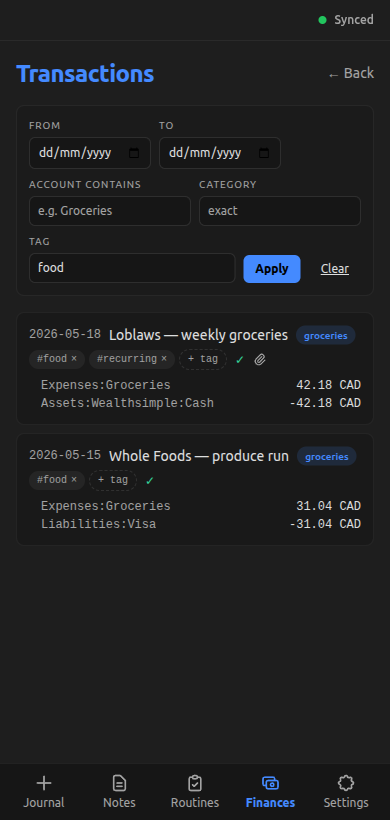
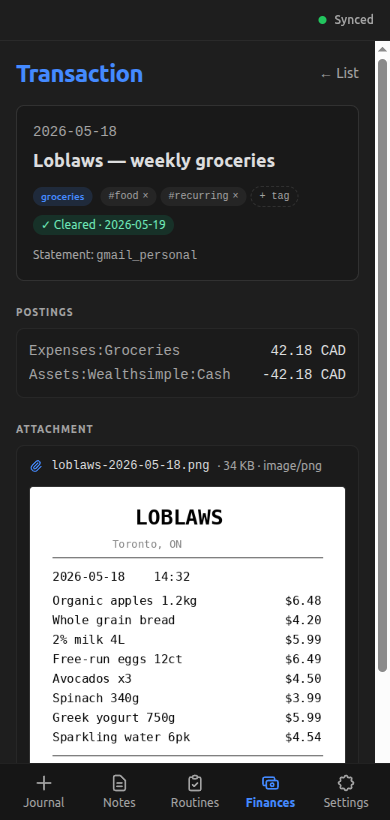
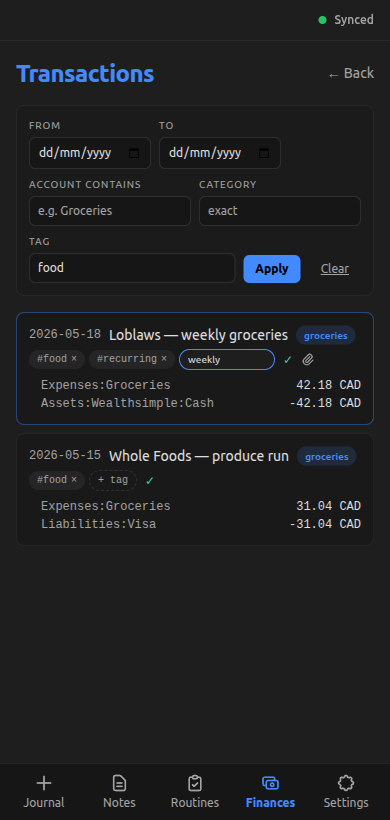

+++
title = "Browse, view, and edit recorded transactions"
slug = "browse-view-edit-transactions"
date = 2026-05-23
updated = 2026-05-23
draft = true

[taxonomies]
tags = ["dioxus", "tauri", "surrealdb", "ux"]
+++

## What does this feature do?

Users can open a list of every transaction recorded in omni-me and filter it by date range, account-name fragment, category, or tag. Tapping a row opens a detail view with the full posting list, the reconciliation source if cleared, and the captured document. That document renders inline — image attachments as a preview, PDFs in an iframe, anything else as a download link. From either the list row or the detail panel, category and tag chips can be clicked to enter an inline edit mode; Enter saves and the chip updates in place, Escape cancels.

## Why was it added now?

The [previous bundle](@/posts/logbook/omni-me/capture-transaction-with-receipt/index.md) shipped the four ways to record a transaction — photo, PDF, email body, manual form — but no way to read back what had been recorded. The same post called the gap out explicitly in its own scope section: "captured transactions 'vanish' until that ships." A capture flow without a read path is one-way — the snap-see-fix loop omni-me is meant to close stays open.

Closing the loop wanted three things: a way to scan recorded transactions, a way to drill into one and see its attached receipt, and a way to fix a wrong category or tag without re-opening the form. Bundling the three was cheaper than landing them separately — they share a wire shape, share edit components, and share the optimistic-update pattern that reverts a failed save on both surfaces.

The detail view's attachment viewer also closed a second gap the previous bundle had flagged: that bundle shipped without rendering the saved file at all, so until the detail view existed, the receipt was stored content-addressably but unreachable from the app.

## What's in scope (and what's not)?

**In:**
- Filters by date range, account substring, category, and tag — AND across set axes
- Load-more pagination at 50 rows per page
- Inline edit for category and tag — on list rows and detail

**Not in:**
- Editing posting amounts, accounts, dates, or descriptions — the capture form is still the only edit surface for those
- Deleting a transaction
- Merging or reconciling two transactions — separate workflow on the backlog
- Saving filter presets as named views

One limitation worth flagging — list pagination state isn't preserved across navigation. Opening a detail view and coming back resets the offset to the first page.

## How do we know it works?

The backend filter machinery passes its tests — six tests against a `tempfile::tempdir` + real `BudgetProjection` fixture, covering all four filter axes plus blank-string normalization plus the empty-filter pass-through:

```bash
cargo test -p omni-me-core events::budget_projection::tests::list_transactions
```

```output
    Finished `test` profile [unoptimized + debuginfo] target(s) in 4.94s
     Running unittests src/lib.rs (target/debug/deps/omni_me_core-24040fdcf48fbb5e)

running 6 tests
test events::budget_projection::tests::list_transactions_blank_strings_treated_as_unset ... ok
test events::budget_projection::tests::list_transactions_empty_filter_returns_all_visible ... ok
test events::budget_projection::tests::list_transactions_filter_by_date_range ... ok
test events::budget_projection::tests::list_transactions_filter_by_category_exact ... ok
test events::budget_projection::tests::list_transactions_filter_by_account_substring_case_insensitive ... ok
test events::budget_projection::tests::list_transactions_filter_by_tag_membership ... ok

test result: ok. 6 passed; 0 failed; 0 ignored; 0 measured; 288 filtered out; finished in 1.44s

     Running tests/extraction_integration.rs (target/debug/deps/extraction_integration-0613c9fc02d283a9)

running 0 tests

test result: ok. 0 passed; 0 failed; 0 ignored; 0 measured; 5 filtered out; finished in 0.00s

```

[`core/src/events/budget_projection.rs:1148`](https://github.com/RustWright/omni-me/blob/c3a3f893e64bfe6690b332261a0175bb50985328/core/src/events/budget_projection.rs#L1148) at `c3a3f89`
> `    async fn list_transactions_filter_by_date_range() {`
>
> Filter test block — six tests against a tempfile::tempdir + real BudgetProjection fixture cover all four filter axes (date range, account substring case-insensitive, category exact, tag membership) plus blank-string normalization plus the empty-filter pass-through. This first test is one of the six; the rest follow immediately below.

The list view drives the filter from the frontend side. The screenshot below applies a `tag:food` filter to the mock-fixture set — two of four rows pass, each rendered ledger-style with category and tag chips, the cleared check, and the attachment paperclip when present:




[`tauri-app/frontend/src/pages/finances.rs:1732`](https://github.com/RustWright/omni-me/blob/c3a3f893e64bfe6690b332261a0175bb50985328/tauri-app/frontend/src/pages/finances.rs#L1732) at `c3a3f89`
> `fn TransactionListView(`
>
> The list view's two-state filter — `draft_filter` for what the FilterBar inputs hold, `active_filter` for what the current page reflects. Typing into a field doesn't fire a query; only Apply copies draft → active, and the `use_effect` re-runs on `active_filter` change. Load-more pagination defaults to 50 rows per page.

The detail view's attachment-render path has its own pure-fn coverage — five tests over MIME classification and the JSON-shape decode for `AttachmentRef`:

```bash
cargo test --manifest-path tauri-app/frontend/Cargo.toml _attachment_
```

```output
    Finished `test` profile [unoptimized + debuginfo] target(s) in 0.18s
     Running unittests src/main.rs (tauri-app/frontend/target/debug/deps/frontend-7befbfb14d91c451)

running 5 tests
test pages::finances::tests::classify_attachment_routes_images_to_image_render ... ok
test pages::finances::tests::classify_attachment_falls_back_to_other_for_unknown_mime ... ok
test pages::finances::tests::classify_attachment_routes_pdf_variants_to_pdf_render ... ok
test pages::finances::tests::extract_attachment_meta_returns_none_when_required_field_missing ... ok
test pages::finances::tests::extract_attachment_meta_decodes_complete_ref ... ok

test result: ok. 5 passed; 0 failed; 0 ignored; 0 measured; 28 filtered out; finished in 0.00s

```

[`tauri-app/frontend/src/pages/finances.rs:2416`](https://github.com/RustWright/omni-me/blob/c3a3f893e64bfe6690b332261a0175bb50985328/tauri-app/frontend/src/pages/finances.rs#L2416) at `c3a3f89`
> `mod tests {`
>
> Pure-fn tests for the attachment-helper layer — `classify_attachment` over image, PDF, and "other" MIME variants (including case-insensitivity), plus `extract_attachment_meta` over complete and missing-required-field refs.

The image-render branch is what the next screenshot shows. The mock backend serves a 35 KB PNG receipt when the Loblaws row is opened; the frontend builds a blob URL via `URL.createObjectURL(Blob)` and binds it to an ``. The path matters when an attachment is large enough that a base64 data URI would bloat the DOM:




What revokes the URL when the user navigates away?

[`tauri-app/frontend/src/pages/finances.rs:2127`](https://github.com/RustWright/omni-me/blob/c3a3f893e64bfe6690b332261a0175bb50985328/tauri-app/frontend/src/pages/finances.rs#L2127) at `c3a3f89`
> `impl Drop for ObjectUrlGuard {`
>
> Object-URL lifetime guard. The `Drop` impl calls `URL.revokeObjectURL` so the WebView doesn't accumulate orphaned blob URLs across navigations. The detail view holds the guard in a `Signal<Option<ObjectUrlGuard>>`, so unmount drops the guard and revokes the URL automatically.

Inline edit happens on both surfaces and uses the same component pair. The screenshot below catches a row mid-edit: a tag input has replaced the `+ tag` affordance, the wrapping row stayed put (the click that opened the input did NOT navigate to detail — that's `stop_propagation` working), and the rest of the list is untouched:




[`tauri-app/frontend/src/pages/finances.rs:1540`](https://github.com/RustWright/omni-me/blob/c3a3f893e64bfe6690b332261a0175bb50985328/tauri-app/frontend/src/pages/finances.rs#L1540) at `c3a3f89`
> `fn EditableCategoryChip(`
>
> The inline-edit chip. Click swaps the chip for an input; Enter saves and the chip updates in place, Escape cancels. Every internal click calls `stop_propagation` so the wrapping list-row button doesn't navigate to detail mid-edit — that's the load-bearing engineering claim of inline editing on a clickable row. Same pattern (click-to-input, Enter saves, Escape cancels, `stop_propagation` on every internal click) drives the tag-list editor too.

What's not in the evidence yet: the live WebView round trip on Android. The screenshots run against `dx serve --features mock` in a desktop browser at mobile viewport (390×820). The synthetic tests cover the helper functions in isolation; the on-device behavior — blob persistence, `ObjectUrlGuard::Drop` actually completing under rapid back-nav, the cleared check rendering at the system font scale — hasn't been exercised live.
