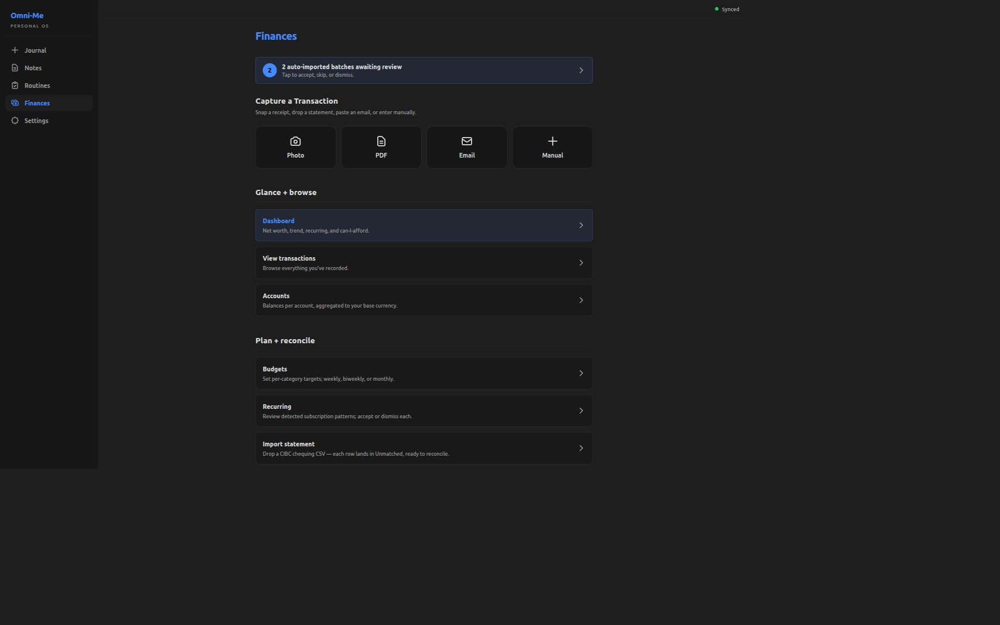
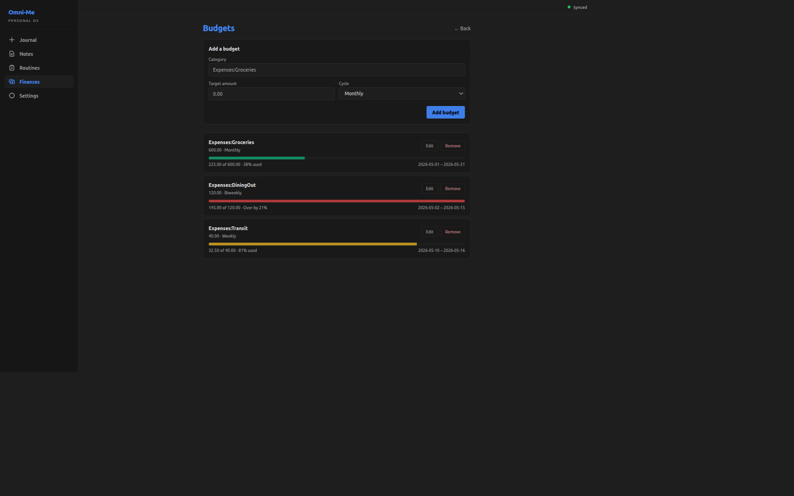

+++
title = "Budget setup with actual-vs-planned progress"
slug = "budget-setup-progress"
date = 2026-05-25
draft = false

[taxonomies]
tags = ["dioxus", "budgeting", "ux"]
+++

## What does this feature do?

The Budgets screen, under the Finances tab, lets the user set a
spending target per expense category (`Expenses:Groceries`,
`Expenses:Transit`, and so on) with a cycle of Weekly, Biweekly, or
Monthly. Each saved budget renders a row showing the target alongside
actual spending in the current cycle — a colored progress bar (green
under 75%, amber up to 100%, red over), an "X of Y · N% used"
readout, and the cycle's date window. Actuals are read live from the
journal each time the screen loads; weekly and monthly cycles are
calendar-anchored (Sunday–Saturday and first-to-last of the month)
while biweekly is a rolling fourteen-day window ending today.

## Why was it added now?

The dashboard widgets — net worth, recurring obligations,
can-I-afford — answer "where do I stand right now?" That's the
descriptive axis. The prescriptive one was unanswered: *am I on track
for what I planned to spend?* The journal already carries the data —
every expense posting has a category and a date — but until the user
supplies a target per category, there's nothing to compare actuals
against. Budgets adds the target side: a form for per-category
targets, plus per-cycle window math on top of the aggregation
pipeline the dashboard already used.

## What's in scope (and what's not)?

**In:** add/edit/remove a budget per category with a Weekly/Biweekly/Monthly cycle; a live progress bar per saved budget.

**Not in:**

- A picker affordance for arbitrary day counts — the schema and window math both accept `custom:N`, but the dropdown holds the line at the three named cadences.
- Carry-forward or envelope-style budgeting — each cycle stands alone; leftover headroom doesn't roll forward, and a previous overrun doesn't shrink the next target.

## How do we know it works?

```bash
cargo test -p omni-me-core --lib budget:: -- --skip balance_check
```

```output

running 19 tests
test budget::tests::biweekly_is_fourteen_days ... ok
test budget::tests::budget_progress_skips_unparseable_period ... ok
test budget::tests::budget_progress_handles_zero_target ... ok
test budget::tests::budget_progress_flags_over_budget ... ok
test budget::tests::budget_progress_ignores_other_categories ... ok
test budget::tests::budget_progress_sums_in_window_postings ... ok
test budget::tests::collect_expense_parsed_drops_non_expense_legs ... ok
test budget::tests::collect_expense_parsed_drops_unconvertible_foreign_leg ... ok
test budget::tests::collect_expense_parsed_skips_malformed_rows ... ok
test budget::tests::collect_expense_parsed_passes_through_base_currency_legs ... ok
test budget::tests::custom_n_parses_positive_integer ... ok
test budget::tests::custom_non_numeric_is_rejected ... ok
test budget::tests::custom_zero_is_rejected ... ok
test budget::tests::monthly_is_thirty_days ... ok
test budget::tests::unknown_period_is_rejected ... ok
test budget::tests::weekly_is_seven_days ... ok
test budget::tests::window_for_custom_n_spans_n_days ... ok
test budget::tests::window_includes_as_of ... ok
test budget::tests::window_returns_none_for_unknown_period ... ok

test result: ok. 19 passed; 0 failed; 0 ignored; 0 measured; 350 filtered out; finished in 0.00s

```

Four buckets. **Cadence parsing** (7 tests): each named cadence
resolves to its day count, `custom:N` parses positive integers with
zero and non-numeric forms rejected, anything else returns `None`.
**Window resolution** (3 tests): the window includes `as_of`,
`custom:N` spans exactly N days, an unknown cadence yields no window.
**Aggregator** (5 tests): actuals sum only postings inside the window
matching the budget's category, the over-budget flag fires when
actuals exceed target, and budgets with unparseable cadences are
skipped silently. **Posting flatten** (4 tests): non-expense legs
drop, foreign legs without a Prices entry drop, base-currency legs
pass through, malformed rows skip.

[`core/src/budget.rs:27`](https://github.com/RustWright/omni-me/blob/55421b3ed61f2d5b4df308a94810c0e7c68b7615/core/src/budget.rs#L27) at `55421b3`
> `pub fn period_to_days(period: &str) -> Option<u32> {`
>
> period_to_days — the cadence parser. `custom:N` is the forward-compat hook the dropdown doesn't yet expose; the test bucket above covers its positive-integer / zero / non-numeric branches.

[`core/src/budget.rs:266`](https://github.com/RustWright/omni-me/blob/55421b3ed61f2d5b4df308a94810c0e7c68b7615/core/src/budget.rs#L266) at `55421b3`
> `pub fn compute_budget_progress(`
>
> compute_budget_progress — the aggregator entry point. Takes the budget set, the flattened postings, and an `as_of` date; per budget, resolves the current window via `current_period_window`, sums matching postings, and returns the `BudgetProgress` rows the screen renders.

```bash
cargo test --manifest-path tauri-app/frontend/Cargo.toml -- period_label progress_color
```

```output

running 5 tests
test pages::finances::tests::period_label_falls_back_to_raw_for_unknown ... ok
test pages::finances::tests::progress_color_picks_red_when_over_budget ... ok
test pages::finances::tests::progress_color_picks_green_under_warning_band ... ok
test pages::finances::tests::progress_color_picks_amber_in_warning_band ... ok
test pages::finances::tests::period_label_uses_named_cadence ... ok

test result: ok. 5 passed; 0 failed; 0 ignored; 0 measured; 54 filtered out; finished in 0.00s

```

Two buckets on the frontend. **Round-trip safety** (2 tests):
`period_label` returns the named display string for known cadences
and falls back to the raw string for unknowns — so a hand-crafted
`custom:90` survives an edit-and-save through the picker without
being silently downgraded. **Bar color** (3 tests): the three-band
policy picks green under 75%, amber up to 100%, red over budget.

[`tauri-app/frontend/src/pages/finances.rs:3239`](https://github.com/RustWright/omni-me/blob/55421b3ed61f2d5b4df308a94810c0e7c68b7615/tauri-app/frontend/src/pages/finances.rs#L3239) at `55421b3`
> `fn progress_color_class(percent_used: f64, over_budget: bool) -> &'static str {`
>
> progress_color_class — the bar-color policy. Takes the percent-used and an over-budget flag; returns the Tailwind class for the bar fill. The three-band cutoffs visible in the screenshots below land in this function.

The screen's entry point lives in the Finances tab's *Plan +
reconcile* section, alongside Recurring and Import statement:




Inside, the screen carries the add form at the top and one progress
row per saved budget. Three rows here illustrate the three color
bands the policy picks:




## What's worth remembering or doing next?

- Cycle history isn't surfaced — once a cycle closes, the bar resets against the new window with no comparison back. The journal still carries the postings, so a "this month vs last month" view is buildable on top. Revisit when comparing across cycles becomes a real question.
- No notification when a budget tips into amber or over the line — the colored bar is the only signal, visible only when the screen is open. Revisit if missing-the-alert friction shows up in daily use.
