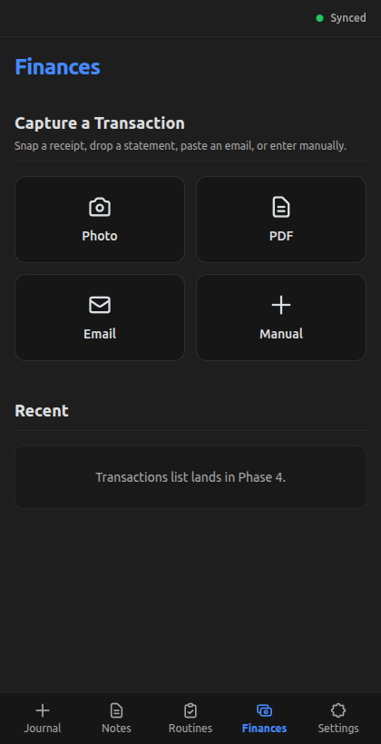
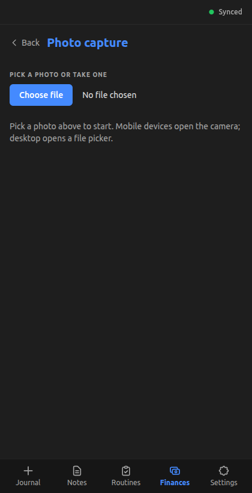
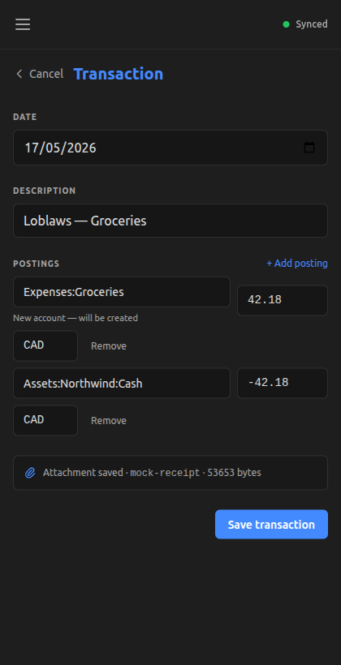

+++
title = "Capture a transaction with its receipt"
slug = "capture-transaction-with-receipt"
date = 2026-05-17
updated = 2026-05-24
draft = false

[taxonomies]
tags = ["dioxus", "tauri", "multimodal", "ux"]
+++

## What does this feature do?

omni-me accepts a transaction through four entry points: a photo, a PDF, the body of an email, or a typed form. The first three route through the server's document extractor, which produces a draft transaction the user confirms. The captured file itself is stored content-addressably on the server and mirrored to an on-device cache, so the original document stays viewable from the transaction record.

## Why was it added now?

The budget pipeline existed end-to-end on the backend before any of this work began: 16 event types, 12 Tauri commands, and three auto-import sources running server-side. None of it had a UI inbound path. The commands were orphan code, reachable only from DevTools — usable on paper, unreachable from the app.

Automatic import — Globepay, Northwind, and an email IMAP poller — was the foreground work for the preceding stretch; the previous personal-finance tracking attempt collapsed when manual sync became tedious enough to abandon, which is why automation got priority. But automatic import only covers what the user's banks export. Everything else — paper receipts, photo receipts, ad-hoc cash transactions, statements from accounts without an API — still needs a hand-driven entry path. Capture is that path.

Persisting the captured file alongside the transaction was the last sub-step before *capture* meant what it sounded like. Without it, the receipt is discarded the moment the transaction is saved, and the auto-import-vs-manual distinction collapses into "either way the source document disappears."

## What's in scope (and what's not)?

**In:**
- Four entry points (photo, PDF, email body paste, manual typed form) all routing to a single confirm-and-save form
- Server-side document extraction (Gemini multimodal; one extractor across all four entry points)
- Content-addressable blob storage for the captured file, mirrored to an on-device LRU cache (200MB cap)
- `AttachmentRef` ride-along on the recorded transaction event

**Not in:**
- **Browsing the saved transactions.** Save commits the event, but no [list view](@/posts/logbook/omni-me/browse-view-edit-transactions/index.md) exists yet — captured transactions "vanish" until that ships.
- **Thumbnail rendering in the confirm form.** The form shows "Attachment saved · filename · N bytes," not the image; rendering ships with the [transaction detail view](@/posts/logbook/omni-me/browse-view-edit-transactions/index.md).
- **Android share-sheet integration.** Sharing an image or PDF to omni-me from another app's share menu doesn't work yet — the manifest declaration and Rust glue are both partial. Deferred to a focused Android-build session.

## How do we know it works?

The on-device attachment cache passes its unit tests — write-then-read roundtrip, miss-returns-None, eviction by mtime order, invalid-hash rejection, and the clear-removes-files-keeps-dir contract that the upcoming Settings cache panel will rely on:

```bash
cargo test -p omni-me-app commands::attachments
```

```output
   Compiling omni-me-app v0.1.0 (/home/me/productive_learning/projects/omni-me/tauri-app/src-tauri)
    Finished `test` profile [unoptimized + debuginfo] target(s) in 1m 28s
     Running unittests src/lib.rs (target/debug/deps/omni_me_app-27d056b92e887d61)

running 5 tests
test commands::attachments::tests::invalid_hash_rejected ... ok
test commands::attachments::tests::miss_returns_none ... ok
test commands::attachments::tests::write_then_read_roundtrips ... ok
test commands::attachments::tests::clear_removes_files_keeps_dir ... ok
test commands::attachments::tests::evict_drops_oldest_first ... ok

test result: ok. 5 passed; 0 failed; 0 ignored; 0 measured; 29 filtered out; finished in 0.10s

     Running unittests src/main.rs (target/debug/deps/omni_me_app-06b87a890aefce3c)

running 0 tests

test result: ok. 0 passed; 0 failed; 0 ignored; 0 measured; 0 filtered out; finished in 0.00s
```

[`tauri-app/src-tauri/src/commands/attachments.rs:1`](https://github.com/RustWright/omni-me/blob/baf3fd48e9d6ea5cebad9590eaaf7de1c2750a11/tauri-app/src-tauri/src/commands/attachments.rs#L1) at `baf3fd4`
> `//! Local attachment cache (Phase 3.7).`
>
> The cache module — the five tests at the bottom `#[cfg(test)] mod tests` block exercise the LRU in isolation, no Tauri runtime involved.

The end-to-end capture-then-confirm flow walks through under `dx serve --features mock`. The Finances tab opens to a capture-tile grid:



Tapping Photo opens the file picker — mobile devices default to the rear camera; desktop opens a chooser:



Picking a file kicks off the extract round trip. The confirm form lands pre-populated — date, description, two postings — with the "Attachment saved · filename · N bytes" line acknowledging that the captured bytes were persisted server-side and mirrored to the on-device cache:



[`server/src/routes/documents.rs:46`](https://github.com/RustWright/omni-me/blob/baf3fd48e9d6ea5cebad9590eaaf7de1c2750a11/server/src/routes/documents.rs#L46) at `baf3fd4`
> `async fn extract_handler(`
>
> The `extract_handler` — when `?attach=true` is set on the query, the same body bytes that get extracted are hashed and stored into the blob dir; the response carries the `AttachmentRef` back in one round trip.

What's not in the evidence yet: the live Gemini round trip is unobserved. The mock backend returns a canned receipt regardless of input bytes; the real `extract_document` path compiles and the server boots, but no live document has been pushed through end-to-end. This is acknowledged here so the post stays honest; if a live-extraction verification happens later, this section gets updated.
