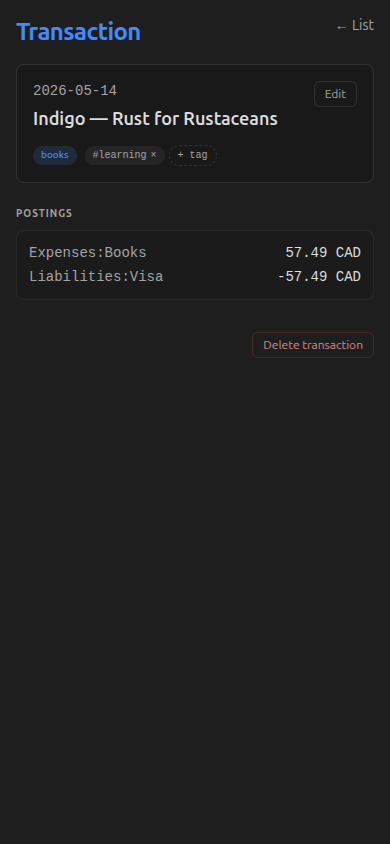

+++
title = "Rebuilding finances around Overview, Ledger and Analyze"
slug = "finances-overhaul"
date = 2026-08-28
updated = 2026-08-28
draft = true

[taxonomies]
tags = ["dioxus", "ui-design", "performance", "ledger"]
+++

## What does this feature do?

omni-me's finances section used to open on a menu. You tapped Finances and got a list of
links — Dashboard, Accounts, Budgets, Reconcile, Import — and only after picking one did
you see an actual number.

It now opens on three surfaces behind a sub-nav that stays put as you move between them.
**Overview** is the daily glance: net worth as a headline figure with its real history
drawn behind it, a range switcher from one month to all-time, balances per institution,
and a review inbox collecting everything waiting on a decision — uncategorised
transactions, unmatched statement rows, auto-import batches needing confirmation.
**Ledger** is the transaction list, searchable and filterable, with each transaction's
detail beside the list on a wide screen and behind a slide-over on a phone. **Analyze**
is the slower surface: cash-flow trend, budget snapshot, and the deeper tools you reach
for monthly rather than daily.

## Why was it added now?

Two threads that turned out to be one.

The first was speed. On the real journal — 10,209 transactions, a 2.4 MB ledger file —
listing a hundred transactions took 250 to 350 milliseconds, because the query scanned
and sorted all ten thousand rows to return the first hundred. The obvious fix was
indexes. So composite indexes went onto a copy of the database and were measured:
330ms became 250ms. A quarter faster, with the scan essentially intact, because
SurrealDB 3.0.4 will not use an index to skip an `ORDER BY` sort. That negative result
is what redirected the work. If the query cannot get much faster, the win has to come
from not re-running it — which is a caching problem in the frontend, not a database one.

The second was that the section's shape did not match how it was used. Its design assumed
the daily act was recording a transaction. It isn't. Almost everything arrives on its own
through bank pollers and receipt extraction, so the daily act is *triaging what already
arrived* — deciding what an uncategorised charge was, matching a statement row against a
transaction already recorded. A menu of links is a poor home for that job, because it
makes you go looking for work that should have been presented to you.

They are one thread because they have the same answer: the daily surface should be cheap
to open and should already show you something. Caching is what makes returning to it
instant; the Overview is what makes the first thing you see a number rather than a table
of contents.

## What's in scope (and what's not)?

In scope: the three surfaces and the sub-nav that persists across them; a net-worth time
series computed from the ledger itself rather than a stand-in; the chart and its range
switcher; a stale-while-revalidate read cache so revisits render from memory; and
master-detail on the Ledger, which is a list plus a detail pane on desktop and a list plus
a slide-over on mobile.

Not in scope:

- **The database question is not resolved.** Indexes were measured and found
  insufficient. Restructuring the query so the sort can be served from an index is still
  open; the cache makes that less urgent, not unnecessary.
- **The corner reserved for an LLM chat is a placeholder with no backend.** It holds the
  space for the interface that is meant to answer questions of that shape later. It does
  not work, and is labelled as such.
- **`finances.rs` is still a single file of roughly seven thousand lines** covering all
  three surfaces. Splitting it is deliberately deferred, with the condition for doing it
  written into the file's own header rather than left to memory.
- **This was verified in a browser against a mocked backend.** The pass on real data, on
  desktop and on a phone, has not run yet.

## How do we know it works?

```bash
cargo test -p omni-me-core --lib -- --test-threads=1 net_worth_series dashboard_summary 2>&1 | sed -n '/^running /,$p'
```

```output
running 5 tests
test dashboard::tests::dashboard_summary_computes_net_worth_excluding_unmatched ... ok
test dashboard::tests::dashboard_summary_returns_no_unmatched_when_absent ... ok
test dashboard::tests::net_worth_series_accumulates_in_date_order ... ok
test dashboard::tests::net_worth_series_endpoint_matches_hero_and_excludes_unmatched ... ok
test dashboard::tests::net_worth_series_one_month_is_daily_and_ends_today ... ok

test result: ok. 5 passed; 0 failed; 0 ignored; 0 measured; 516 filtered out; finished in 0.00s

```

Five tests on the core side, covering the one property the whole Overview rests on:
**the chart and the headline number cannot disagree.**
`net_worth_series_endpoint_matches_hero_and_excludes_unmatched` asserts that the series'
final point equals the figure the hero displays — both computed through the same account
filter, both excluding the `Unmatched` clearing account that import uses to park a
half-known transaction. The other four cover the series' shape (balances accumulate in
date order rather than insertion order; a one-month range samples daily and ends on
today) and the hero's own arithmetic, with and without unmatched transactions present.

```bash
cargo test --manifest-path tauri-app/frontend/Cargo.toml -- --test-threads=1 finances_back_target bar_height_pct max_trend_magnitude 2>&1 | sed -n '/^running /,$p'
```

```output
running 8 tests
test pages::finances::tests::bar_height_pct_clamps_to_100 ... ok
test pages::finances::tests::bar_height_pct_scales_correctly ... ok
test pages::finances::tests::bar_height_pct_zero_scale_returns_zero ... ok
test pages::finances::tests::finances_back_target_maps_drilldowns_to_parents ... ok
test pages::finances::tests::finances_back_target_multi_origin_follows_return_to ... ok
test pages::finances::tests::finances_back_target_none_exactly_at_surface_roots ... ok
test pages::finances::tests::max_trend_magnitude_picks_largest_absolute_across_income_and_spending ... ok
test pages::finances::tests::max_trend_magnitude_returns_none_when_all_zero ... ok

test result: ok. 8 passed; 0 failed; 0 ignored; 0 measured; 77 filtered out; finished in 0.00s

```

Eight on the frontend, in two groups. The `finances_back_target` trio is what makes the
three-surface model coherent rather than merely drawn: back from a drill-down lands on
the surface that owns it, a screen reachable from two places follows the route that
actually got you there, and the three surface roots have no back target at all — which is
what stops the sub-nav from being something you can reverse out of. The chart-geometry
tests cover bar heights (scaling, clamping at 100%, and a zero scale not dividing by
zero) and the trend's magnitude pick, which has to consider income and spending together
so the two halves of the cash-flow chart share one axis.

[`core/src/dashboard.rs:401`](https://github.com/RustWright/omni-me/blob/76b61f26128359452c1005ce1c7707cf284b47a8/core/src/dashboard.rs#L401) at `76b61f2`
> `pub fn net_worth_series(`
>
> The series entry point. Walks the parsed ledger in date order keeping a running balance, then samples it at the range boundaries — converting each sample through the price table as it stood on that date, not today's. That last detail is what stops a later currency move from silently rewriting your past.

[`tauri-app/frontend/src/pages/finances.rs:196`](https://github.com/RustWright/omni-me/blob/76b61f26128359452c1005ce1c7707cf284b47a8/tauri-app/frontend/src/pages/finances.rs#L196) at `76b61f2`
> `fn surface_of(view: FinancesView) -> FinancesSurface {`
>
> Every finances screen maps to exactly one of the three surfaces here. This is what lets the sub-nav stay mounted and still highlight the right tab from any depth — the header asks which surface the current view belongs to, rather than tracking navigation history itself.

[`tauri-app/frontend/src/continuity.rs:345`](https://github.com/RustWright/omni-me/blob/76b61f26128359452c1005ce1c7707cf284b47a8/tauri-app/frontend/src/continuity.rs#L345) at `76b61f2`
> `    pub fn cache_get<T: serde::de::DeserializeOwned>(&self, key: &str) -> Option<T> {`
>
> The read side of the stale-while-revalidate cache. A surface seeds itself from this synchronously as it mounts and re-fetches in the background, which is what makes a return visit render immediately instead of paying the query again. It is deliberately in-memory only — a cache that survived a restart would be a second source of truth.

Tests cover the arithmetic and the routing; the rest is whether the three surfaces
actually read as three surfaces. These are the browser build against a mocked backend —
the account roster is fictional and the figures are fixtures, but the layout, the chart
and the navigation are the real components.

Overview opens on a number rather than a menu:


Ledger puts the detail beside the list, so picking a row does not cost you your place:


The same screen at phone width, where the detail becomes a slide-over with its own way
back to the list:




And Analyze, the surface you visit monthly rather than daily — charts first, then the
deeper tools:


## What's worth remembering or doing next?

- **The most useful result here is a negative one.** Adding an index to speed up a
  sorted, limited query is such an obvious move that it would have been attempted twice
  if the measurement had not been written down with its numbers. It now is.
- **Co-mounting a list and its detail creates a bug that neither has alone.** Once the
  Ledger showed both at once, editing a transaction in the detail pane updated the pane
  and the backend but not the adjacent row — so an edited row showed stale values, and a
  deleted one lingered until something else forced a reload. The fix is a refresh counter
  that the list subscribes to and the detail increments after each successful mutation.
  This bug cannot exist while the detail is a separate full-screen route that unmounts the
  list, which is precisely why it appeared the moment the two shared a screen.
- **A Dioxus `rsx!` block cannot parse a nested `format!("{:.2}")`.** Those strings have
  to be computed before the macro, not inside it.
- **Still to do: the end-to-end pass on real data, on both form factors.** The mock bridge
  cannot reach the journal path the net-worth series actually reads, so that series has
  never run against ten thousand real transactions — only against synthetic data.
