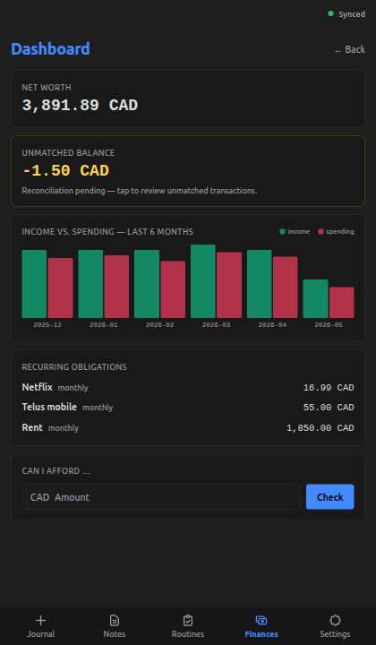
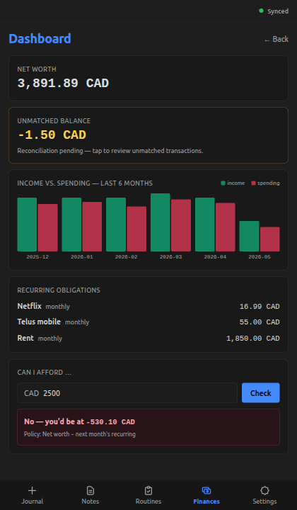

+++
title = "Financial-health dashboard"
slug = "financial-health-dashboard"
date = 2026-05-23
updated = 2026-05-24
draft = false

[taxonomies]
tags = ["dioxus", "ledger", "mobile-development", "ui", "ux"]
+++

## What does this feature do?

The Dashboard, under the Finances tab, is a single screen that answers
a few "where do I stand right now?" questions at a glance. A
**net-worth** card sums the user's tracked accounts in their base
currency. An **Unmatched balance** card surfaces the reconciliation
pending — a non-zero number means transactions are sitting in the
clearing account waiting to be matched, and tapping it jumps into the
[transaction list](@/posts/logbook/omni-me/browse-view-edit-transactions/index.md) filtered to those rows. A **monthly trend** bar chart
shows income vs. spending over the last several months. A **recurring
obligations** card lists the confirmed subscriptions and rent-shaped
expenses from the user's confirmed recurring-pattern set. And a
**Can-I-Afford** widget takes an amount and answers yes or no — its
policy subtracts the next month's confirmed recurring obligations from
net worth before deciding, so a tight-but-positive remaining isn't
enough; the verdict goes "yes" only when there's room above the
upcoming bills.

## Why was it added now?

Personal finance "glance" is the answer to a few questions the user
would otherwise answer by scrolling the transaction list and doing
arithmetic: *am I trending up or down this quarter?*, *are there
obligations next month I'm not seeing?*, *is there room for this
purchase right now?* The Dashboard collapses each into a card so the
answer is visible without further work. The moment was right because
the data infrastructure had landed in pieces over the previous weeks:
the per-account base-currency aggregation came up alongside the
[Accounts screen](@/posts/logbook/omni-me/account-list-multi-currency/index.md) and made net worth a one-line sum; the auto-import
pipeline started writing transactions into the clearing account so the
Unmatched balance became a real signal; and the recurring-pattern
table existed in the projection schema with a confirmed slot waiting
for the detection scanner to populate it. The Dashboard's job was to
turn that converged infrastructure into a glance.

## What's in scope (and what's not)?

**In:** the five widgets, Unmatched click-through into the transaction
list, Can-I-Afford with its recurring-aware verdict.

**Not in:**

- Custom trend windows — the monthly trend is fixed at the last few
  months; the Transactions screen carries date-range filtering for
  anything wider.
- Forecasting or projection — the dashboard answers "where do I stand
  now," not "where will I stand later."
- Per-widget configuration — no hide/show, reorder, or threshold
  alerts.

## How do we know it works?

The aggregator and the policy each carry their own test surface:

```bash
cargo test -p omni-me-core --lib dashboard::
```

```output

running 14 tests
test dashboard::tests::can_i_afford_false_when_balance_lands_exactly_zero ... ok
test dashboard::tests::can_i_afford_false_when_amount_exceeds_balance_minus_recurring ... ok
test dashboard::tests::can_i_afford_false_when_net_worth_unavailable ... ok
test dashboard::tests::can_i_afford_treats_negative_amount_as_refund ... ok
test dashboard::tests::can_i_afford_true_when_balance_clears_recurring_and_amount ... ok
test dashboard::tests::bucket_postings_drops_unconvertible_foreign_commodity ... ok
test dashboard::tests::bucket_postings_groups_by_month_and_flips_income_sign ... ok
test dashboard::tests::month_range_returns_continuous_oldest_to_newest ... ok
test dashboard::tests::distill_recurring_keeps_only_confirmed ... ok
test dashboard::tests::months_back_label_handles_year_rollover ... ok
test dashboard::tests::next_month_recurring_total_drops_foreign_commodity ... ok
test dashboard::tests::next_month_recurring_total_scales_by_cadence ... ok
test dashboard::tests::dashboard_summary_computes_net_worth_excluding_unmatched ... ok
test dashboard::tests::dashboard_summary_returns_no_unmatched_when_absent ... ok

test result: ok. 14 passed; 0 failed; 0 ignored; 0 measured; 303 filtered out; finished in 0.00s

```

Two buckets. **Aggregator structure** (9 tests): net worth excludes
`Unmatched`, `Unmatched` optionality, trend bucketing including the
sign-flip for `Income:*` postings, trend drops unconvertible foreign
legs, recurring distillation keeps only confirmed rows, cadence-aware
monthly total, month-range edges (year rollover and continuous
oldest-to-newest). **Can-I-Afford policy** (5 tests): yes when net
worth clears recurring + amount; no when the amount exceeds the
headroom; no when balance lands exactly at zero (the strict-`>` rule
from the policy decision); no when net worth is unavailable; negative
amounts treated as refunds.

[`core/src/dashboard.rs:101`](https://github.com/RustWright/omni-me/blob/baf3fd48e9d6ea5cebad9590eaaf7de1c2750a11/core/src/dashboard.rs#L101) at `baf3fd4`
> `pub fn dashboard_summary(`
>
> Pure-function entry point — produces the four-widget payload (net worth, Unmatched, monthly trend, recurring) from a parsed journal, declared accounts, and confirmed recurring patterns.

[`core/src/dashboard.rs:348`](https://github.com/RustWright/omni-me/blob/baf3fd48e9d6ea5cebad9590eaaf7de1c2750a11/core/src/dashboard.rs#L348) at `baf3fd4`
> `pub fn can_i_afford(amount: Decimal, summary: &DashboardSummary) -> AffordVerdict {`
>
> The Can-I-Afford policy — strict-`>` boundary so a balance landing exactly at zero reads as can't-afford.

Two shots from the rendered dashboard in mock mode. The overview
first — all five widgets in their default state:




Then Can-I-Afford with a $2,500 amount typed in — the policy nets out
the next month's $1,921.99 of recurring obligations before deciding,
so the verdict comes back "No, you'd be at −$530.10":




## What's worth remembering or doing next?

- The Can-I-Afford verdict treats net worth as a single number — it
  doesn't distinguish between liquid assets (cash you can spend today)
  and the credit-card liability offset that nets into the total. The
  next round of polish lifts the verdict into a liquidity-aware
  variant; revisit when "can I afford this without dipping into
  illiquid assets" becomes a real question.
- The Can-I-Afford policy-as-a-spectrum could be a concepts demo —
  naive cash check → cash minus next month's recurring → liquidity-
  aware → forecast-aware. Lets a reader play with the same inputs
  through each policy and see when the verdicts diverge; surfaces the
  load-bearing role of the policy decision itself.
