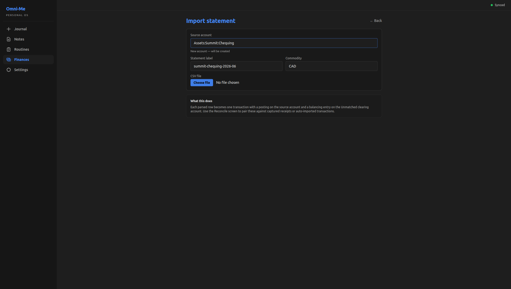
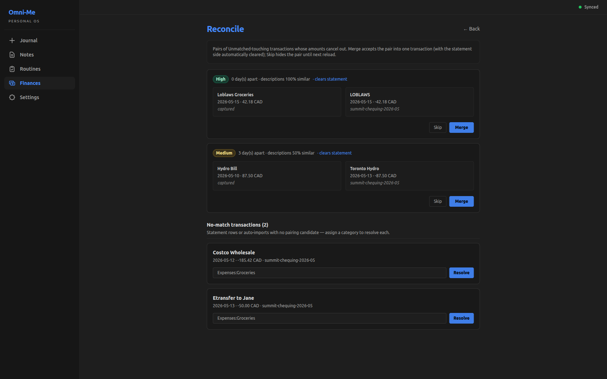
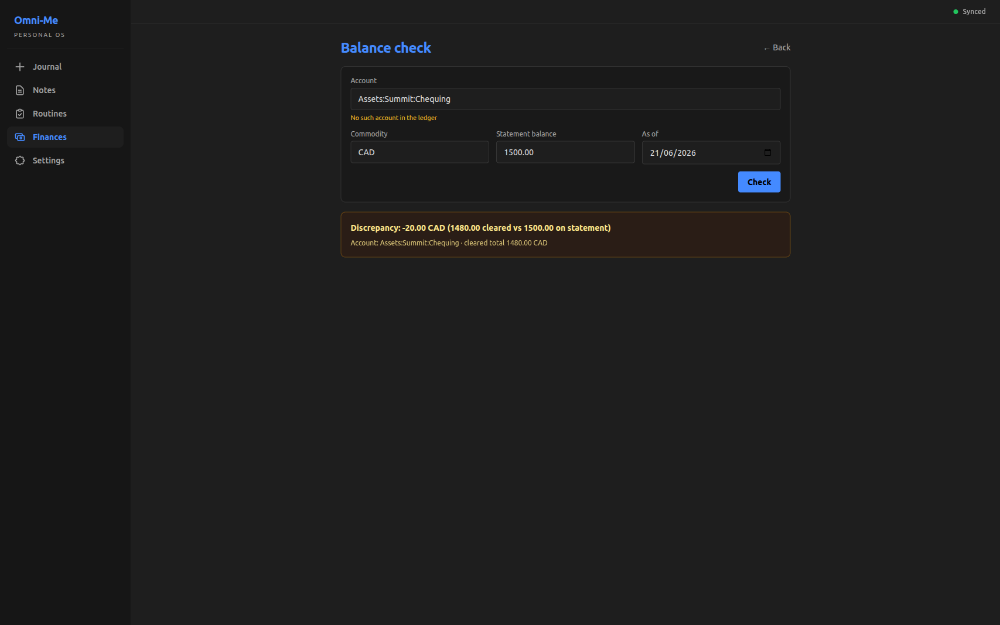

+++
title = "Reconciling multi-source transactions"
slug = "reconciling-multi-source-transactions"
date = 2026-05-26
draft = false

[taxonomies]
tags = ["dioxus", "ledger", "event-sourcing"]
+++

## What does this feature do?

Reconciliation in omni-me is the workflow that lines up transactions
that describe the same money movement but came from different
sources. The Finances tab carries three screens for it:

- **Import statement** parses a bank statement CSV; each row becomes a transaction with one leg on the source account and a balancing leg on the `Unmatched` clearing account.
- **Reconcile** surfaces candidate pairs — statement-import rows and captured or auto-imported transactions whose amounts cancel out — with a confidence pill above each pair; Merge accepts the pair into one transaction (and marks it cleared when one side traces back to a statement), Skip hides it until reload. The same screen carries a *No-match transactions* section where statement rows with no pairing candidate are resolved by assigning a category.
- **Balance check** computes an account's cleared total through a given date and compares it to the statement's reported closing balance, returning balanced or a numeric discrepancy.

## Why was it added now?

Transactions arrive in omni-me from several independent sources —
captured receipts and PDFs, auto-imported feeds from banks and
email, and imported statement CSVs. Any single money movement can
show up in two of them: a Loblaws receipt the user snapped on their
phone is also a row on the chequing statement at the end of the
month. Without a reconciliation step the journal double-counts: the
dashboard's spending number inflates, the cleared-balance audit
drifts, and the data layer the rest of the planning surface depends
on stops being trustworthy. The `Unmatched` clearing account is the
mechanism that makes multi-source ingestion eventually consistent:
every incoming row carries a balancing leg on `Unmatched`, so the
journal stays balanced, but the non-zero `Unmatched` total is the
visible reminder of what hasn't been matched yet. Reconciliation
drains that account.

## What's in scope (and what's not)?

**In:** Statement-CSV import landing in the `Unmatched` clearing account; candidate-pair surfacing with merge and no-match resolution; balance check against statement closing total.

**Not in:**

- Auto-merge without user approval. Even High-confidence candidates require an explicit Merge click — the user is the authority on whether two rows describe the same money movement, not the algorithm.
- Three-way merges. The matcher pairs two transactions at a time, so a captured receipt + auto-import + statement row for the same purchase collapses across two reconciliation passes, not one.

## How do we know it works?

```bash
cargo test -p omni-me-core --lib -- statement_csv reconciliation balance_check
```

```output

running 22 tests
test budget::tests::balance_check_negative_discrepancy_means_cleared_short_of_statement ... ok
test budget::tests::balance_check_zero_discrepancy_is_ok ... ok
test budget::tests::balance_check_positive_discrepancy_means_cleared_exceeds_statement ... ok
test reconciliation::tests::description_similarity_no_overlap_is_zero ... ok
test reconciliation::tests::description_similarity_partial_overlap ... ok
test reconciliation::tests::finds_obvious_pair_same_amount_opposite_sign_same_day ... ok
test reconciliation::tests::day_gap_lowers_score ... ok
test reconciliation::tests::clears_statement_only_when_exactly_one_side_has_source ... ok
test reconciliation::tests::description_similarity_full_overlap_is_one ... ok
test reconciliation::tests::pair_appears_only_once_in_output ... ok
test reconciliation::tests::output_is_sorted_by_score_descending ... ok
test reconciliation::tests::rejects_amount_mismatch ... ok
test reconciliation::tests::rejects_outside_days_window ... ok
test reconciliation::tests::rejects_currency_mismatch ... ok
test reconciliation::tests::rejects_same_sign_pairs ... ok
test statement_csv::tests::parse_chequing_csv_empty_input_errors ... ok
test statement_csv::tests::parse_chequing_csv_handles_zero_amount_as_skip ... ok
test statement_csv::tests::parse_chequing_csv_accepts_legacy_us_date_format ... ok
test statement_csv::tests::parse_chequing_csv_rejects_both_debit_and_credit_populated ... ok
test statement_csv::tests::parse_chequing_csv_basic ... ok
test statement_csv::tests::parse_chequing_csv_skips_blank_blank_row ... ok
test statement_csv::tests::parse_chequing_csv_skips_header_row ... ok

test result: ok. 22 passed; 0 failed; 0 ignored; 0 measured; 347 filtered out; finished in 0.00s

```

Three buckets on the core side. **Parser** (7 tests): happy-path
round-trip; skips the header row, blank-blank rows, and zero-amount
rows; accepts legacy US date format as a fallback; rejects rows with
both debit and credit populated; errors on empty input. **Matcher**
(12 tests): gate logic (rejects amount mismatch, outside-days window,
currency mismatch, same-sign pairs); description-similarity scoring
over token overlap (full / partial / none); the happy-path pair
(same-amount, opposite-sign, same-day); de-duplication so each pair
appears once in output; score-monotonicity (day gap lowers score);
the cleared-flag policy fires only when exactly one side has a
statement source; output stable in score-descending order.
**Balance check** (3 tests): zero discrepancy on a balanced account;
positive discrepancy when cleared exceeds statement; negative when
cleared falls short.

[`core/src/statement_csv.rs:75`](https://github.com/RustWright/omni-me/blob/baf3fd48e9d6ea5cebad9590eaaf7de1c2750a11/core/src/statement_csv.rs#L75) at `baf3fd4`
> `pub fn parse_chequing_csv(csv: &str) -> Result<Vec<ParsedStatementRow>, CsvParseError> {`
>
> parse_chequing_csv — the CSV parser entry. Returns a format-agnostic ParsedStatementRow shape (date, description, amount + sign direction); the caller layers on the source-account + Unmatched-leg construction at the Tauri-command boundary.

[`core/src/reconciliation.rs:69`](https://github.com/RustWright/omni-me/blob/baf3fd48e9d6ea5cebad9590eaaf7de1c2750a11/core/src/reconciliation.rs#L69) at `baf3fd4`
> `pub fn find_match_candidates(`
>
> find_match_candidates — the matching engine entry. Walks Unmatched-touching transactions pairwise, gates on amount-cancels-out + same-commodity + within-days-window, scores survivors by day-decay + description-similarity, and returns pairs in score-descending order (lex-stable so the same input yields the same output).

[`core/src/budget.rs:208`](https://github.com/RustWright/omni-me/blob/baf3fd48e9d6ea5cebad9590eaaf7de1c2750a11/core/src/budget.rs#L208) at `baf3fd4`
> `pub fn balance_check(`
>
> balance_check — sums the cleared postings on the supplied account up through the as-of date, then subtracts the statement's reported closing balance. Zero is balanced; any non-zero is the discrepancy the verdict card surfaces.

```bash
cargo test --manifest-path tauri-app/frontend/Cargo.toml -- confidence
```

```output

running 2 tests
test pages::finances::tests::confidence_color_class_aligns_with_label ... ok
test pages::finances::tests::confidence_label_thresholds ... ok

test result: ok. 2 passed; 0 failed; 0 ignored; 0 measured; 57 filtered out; finished in 0.00s

```

Two tests for the confidence pill on the frontend side: the
threshold cutoffs (High at ≥0.85, Medium at ≥0.6, Low below) and the
consistency between the label and its rendered color class.

The user starts by dropping a chequing-account CSV into the importer:




Once rows have landed in `Unmatched`, the Reconcile screen finds
pairs to merge and surfaces no-match rows for category resolution:




When the workflow is done, Balance check audits the result against
the statement's reported total:




## What's worth remembering or doing next?

- The matching engine is a concepts-demo candidate: a pure-transform WASM island taking fake `Unmatched`-touching transactions, surfacing ranked candidates, and rendering the merge. Teaches the balance-zero invariant interactively.
- Cross-commodity matching is deferred (same-commodity gate today). Workaround: merge cross-currency pairs manually. Revisit when FX-pair patterns are common enough to make the manual path painful.
- A balancing-posting affordance for hidden fees (wire fees, FX spread) is deferred. Workaround: record a separate manual fee transaction. Revisit if reconciliation often needs a third leg.
- CSV format variants deferred — credit-card layout adds a column the chequing parser doesn't read; non-Summit banks need their own parser. Sign convention already covers Asset and Liability accounts uniformly.
