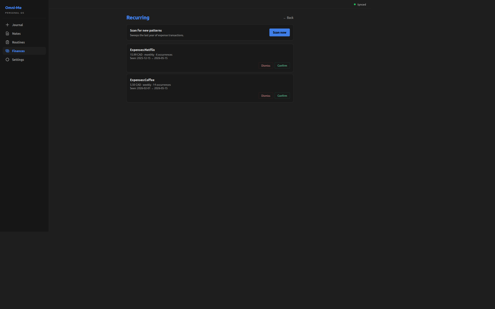

+++
title = "Recurring transaction detection and confirmation"
slug = "recurring-detection-confirmation"
date = 2026-05-25
draft = false

[taxonomies]
tags = ["dioxus", "event-sourcing", "budgeting"]
+++

## What does this feature do?

The Recurring screen, under the Finances tab, surfaces transactions
that look like subscriptions or other recurring expenses — same
category, same amount, consistent cadence — and lets the user
Confirm or Dismiss each one. A "Scan now" button runs the detector
immediately; a nightly background pass runs once the app has been up
for a minute. Each pattern card shows the category, amount +
commodity, cadence, occurrence count, and the first-to-last seen
date range. Confirmations survive re-scans: the pattern id derives
from the vendor/amount/cadence shape, so an already-tracked
recurrence isn't asked about a second time.

## Why was it added now?

Planning needs a list of recurring obligations: the dashboard's
Recurring widget renders them, and the Can-I-Afford verdict
subtracts next month's total from net worth before answering yes or
no. Manually entering every subscription is the obvious way to
populate that list — but the journal already carries the
transactions, and a same-category / same-amount / consistent-cadence
shape is detectable. False positives are the catch: a few
coincidentally-aligned charges look like a pattern, so detection is
a proposal that the user either Confirms or Dismisses.

## What's in scope (and what's not)?

**In:** Scan-now + nightly background detection of expense recurrences; per-pattern Confirm/Dismiss; confirmed patterns survive re-scans.

**Not in:**

- Variable-amount patterns — a water bill that floats $40-$60 month-to-month won't match. Identical-amount is the constraint that keeps the false-positive rate sane.
- Income-side recurrences — the scanner sweeps expense legs only. Salary and stipend deposits would call for a different shape and different downstream value, so they belong in their own feature, not under Recurring.

## How do we know it works?

```bash
cargo test -p omni-me-core --lib recurring::
```

```output

running 11 tests
test recurring::tests::custom_cadence_returns_median_when_consistent ... ok
test recurring::tests::derive_pattern_id_is_stable ... ok
test recurring::tests::median_correctness_on_odd_length ... ok
test recurring::tests::stale_pattern_with_year_long_gap_is_rejected ... ok
test recurring::tests::monthly_with_28_31_day_variation_is_accepted ... ok
test recurring::tests::different_amounts_do_not_group ... ok
test recurring::tests::group_below_minimum_occurrences_is_skipped ... ok
test recurring::tests::irregular_gaps_are_not_recurring ... ok
test recurring::tests::monthly_pattern_detected ... ok
test recurring::tests::weekly_pattern_detected ... ok
test recurring::tests::weekly_with_one_outlier_is_still_recurring ... ok

test result: ok. 11 passed; 0 failed; 0 ignored; 0 measured; 358 filtered out; finished in 0.00s

```

Three buckets. **Cadence classification** (5 tests): real monthly
cadences with 28-31-day jitter pass; a single off-rhythm gap in an
otherwise weekly stream still counts as weekly; the median-day
calculation lands correctly on odd-length gap sequences (a regression
test for an off-by-one caught during the original implementation);
custom cadences pass through with their median when gaps agree;
truly irregular sequences are rejected. **Scanner grouping and
filtering** (5 tests): monthly and weekly streams produce detected
patterns; same-vendor transactions with different amounts don't
merge; groups with fewer than three occurrences are skipped
(`MIN_OCCURRENCES = 3`); a year-long staleness gap rejects an
otherwise-clean rhythm. **Determinism** (1 test): the pattern id
derived from the vendor/amount/cadence shape is stable across runs —
what lets the user's Confirm or Dismiss survive a re-scan.

[`core/src/recurring.rs:57`](https://github.com/RustWright/omni-me/blob/55421b3ed61f2d5b4df308a94810c0e7c68b7615/core/src/recurring.rs#L57) at `55421b3`
> `pub fn classify_cadence(gaps_days: &[u32]) -> Option<u32> {`
>
> classify_cadence — takes the sorted day-gaps between occurrences and returns the median cadence if every gap falls inside that median's tolerance bucket (7-day, 14-day, 30-day, or pass-through). The all-gaps-must-agree check is what keeps a few coincidentally-spaced charges from being labeled a pattern.

[`core/src/recurring.rs:97`](https://github.com/RustWright/omni-me/blob/55421b3ed61f2d5b4df308a94810c0e7c68b7615/core/src/recurring.rs#L97) at `55421b3`
> `pub fn detect_patterns(txn_rows: &[TxnPostingsRow]) -> Vec<DetectedPattern> {`
>
> detect_patterns — the scanner entry. Groups transactions by (category, signed amount, commodity), drops groups below MIN_OCCURRENCES, sorts each group's dates, computes day-gaps, calls classify_cadence, and emits one DetectedPattern per accepted group.

[`tauri-app/src-tauri/src/recurring_scanner.rs:25`](https://github.com/RustWright/omni-me/blob/55421b3ed61f2d5b4df308a94810c0e7c68b7615/tauri-app/src-tauri/src/recurring_scanner.rs#L25) at `55421b3`
> `pub fn spawn(`
>
> spawn — the boot-spawned nightly task. 60-second warm-up so the first scan doesn't compete with app startup, then a 24-hour cadence indefinitely. Each tick calls detect_patterns over the current journal and emits RecurringTransactionDetected events for pattern ids that aren't already in the recurring_patterns table.

The Recurring screen renders the Scan-now affordance at the top and
one card per detected pattern below — each carrying the data the user
needs to decide:




## What's worth remembering or doing next?

- Inline-edit per detected pattern is deferred — the workflow today is binary Confirm/Dismiss. Workaround: dismiss + wait for the next scan, since the detector re-emits on its next tick. Revisit if dismiss-and-rescan starts to feel like real friction.
- Amount drift creates a new pattern, not an edit. The pattern id incorporates the amount, so a $15.99 Netflix bumping to $17.99 is a new pattern asking for a fresh Confirm.
- The cadence classifier's "median + per-bucket tolerance + all-gaps-must-agree" policy is a concepts-demo candidate — a playable page that takes a sequence of dates and shows when the classifier accepts vs rejects.
